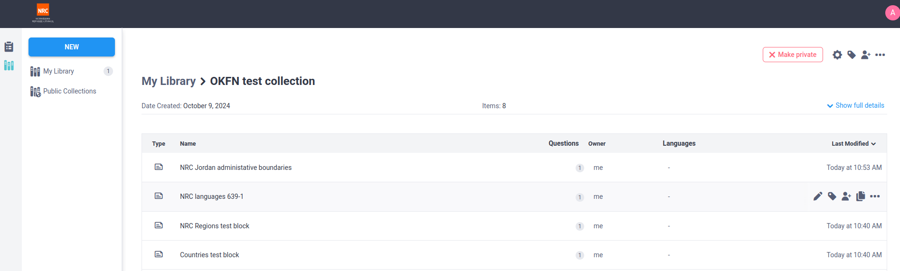
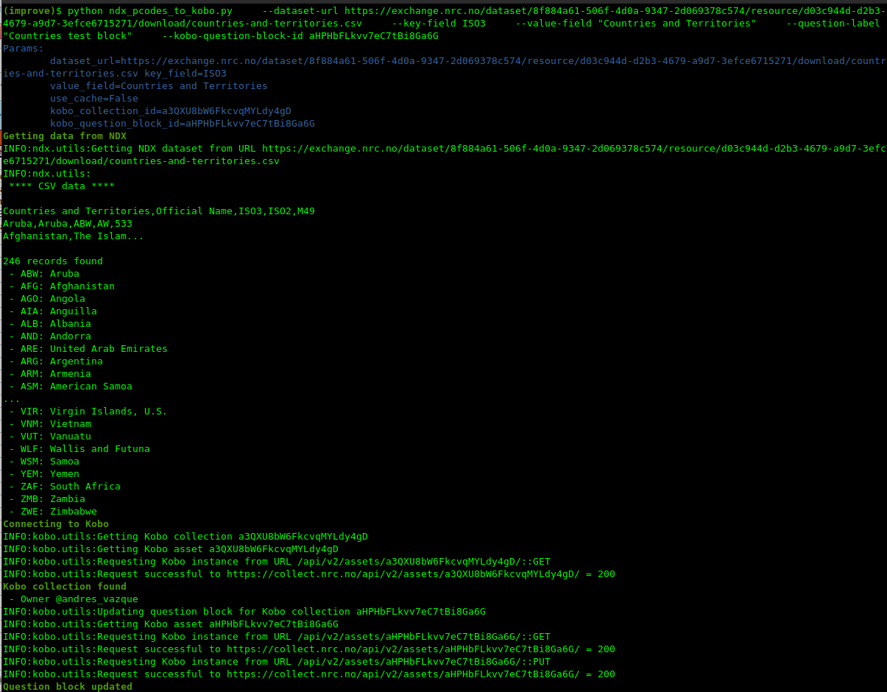
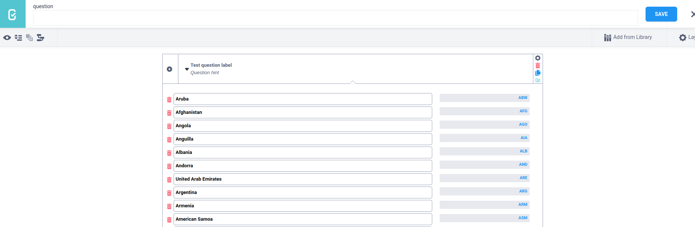

# CKAN to KoBo

This script is for technical users with Python familiarity who would like to pull CKAN datasets into their Kobo instance. This will create Kobo Collection question blocks from Kobo resource files.

## How to use it

Create a virtual environment and install the requirements:

```bash
python3 -m venv venv
source venv/bin/activate
pip install -r requirements.txt
```

Copy the config-sample.json to config.json and fill in the fields.  

```json
{
    "ckan_api_token": "XXXX",
    "kobo_base_url": "XXXX",
    "kobo_api_token": "XXXXX",
    "kobo_collection_id": "Optional. Define here the collection ID that will be the frame of work"
}
```

The `kobo-collection-id` can be also defined as a command parameter with `--kobo-collection-id`
This is a required value.  

Also, you'll need to define:
 - `--dataset-url` - The URL of the CKAN dataset that will be used to create the question block
 - `--key-field` - The field from the CSV that will be used as the key in the question block
 - `--value-field` - The field from the CSV that will be used as the value in the question block
 - `--question-label` - The label of the question block
 - `--kobo-question-block-id` - The ID of the question block that will be updated.
   If not defined, a new question block will be created

## KoBo test



## Example

Command to update existing question block with a sample dataset consisting of countries from a CKAN dataset:

```bash
python ndx_pcodes_to_kobo.py \
    --dataset-url XXX \
    --key-field ISO3 \
    --value-field "Countries and Territories" \
    --question-label "Countries test block" \
    --kobo-question-block-id XXX
```



Results



## Questions / Issues
This script was made in collaboration with Open Knowledge Foundation and Norwegian Refugee Council as inspired by a script to pull HDX P-Codes into Kobo. See link [here](https://gist.github.com/joshuaberetta/086180242408ead944245c14a9e03872). Please feel free to start an issue or send direct questions to Andrés Vázquez (@avdata99) or Nadine Levin (@nadineisabel). Thanks for reading!

## License
